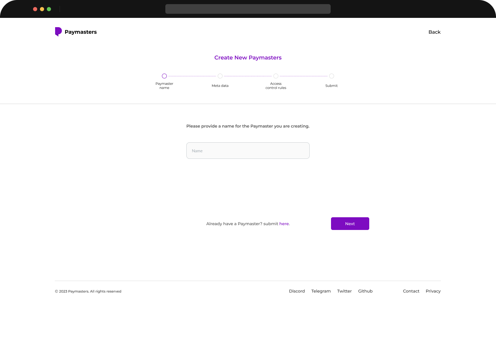

# 🚀 Features


_Paymasters.io provides the infrastructure from which users can access and use paymasters, basically being able to opt-in to any paymaster of choice and also providing a means for institutions/dApps to noticeably propagate this feature to their users._


## Contract

To run the paymasters.io contract, please go through the readme and clone the project. Here is a link to our contract [https://github.com/paymasters-io/contracts/tree/main](https://github.com/paymasters-io/contracts/tree/main)

## Demo

Few months ago, the _team_ at paymasters.io pitched paymasters.io to the web3 community. Here is a walkthrough of our presentation&#x20;



### Summary of the features

* Easily create paymasters right from the user interface **without writing** any line of code.
* View your paymaster's transaction history and other information from the dashboard
* View the list of paymaster contracts and select an active paymaster.
* Chart
* Access control
* NFT gate
* ERC20 gate
* OnChain rebates
* Human verification and more

### Getting Started

To get started, you can go to our dashboard.



When you navigate to the dashboard, click on the smart connect at the top right corner and connect to a wallet. After which you can proceed with creating a paymaster.

<figure><figcaption>
Create New Paymasters Screen
</figcaption></figure>


Please note that more features are still being added to the dashboard.


