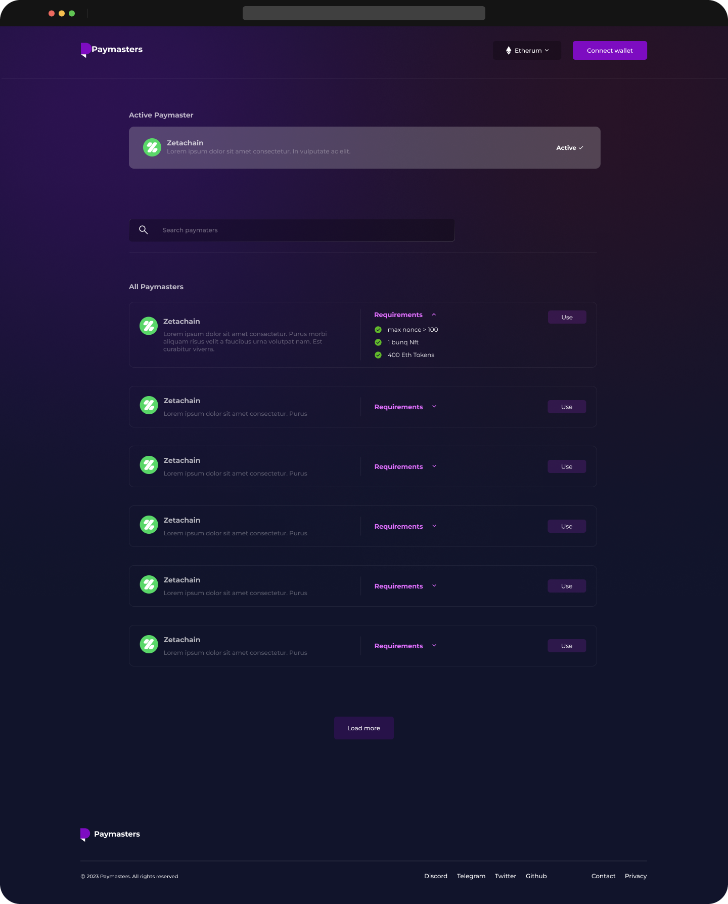

# 📦 Paymasters


Modular paymaster. A paymaster that opens the doors to innovation


## Modular Paymaster

"Modular Paymaster" is a type of paymaster that opens the doors to innovation. The smart contract empowers users to define custom modules for our verifying paymaster validation. You can now focus solely on your business logic, while we handle the intricate gas abstraction layer for your users.

## ERC20 Paymasters (Multi-Standard token)

Our ERC20 Paymaster sets the **gold standard** for gas abstraction. You may ask what do we mean by **gold standard** for gas abstraction.  This means that with our smart contract, users can pay for transactions using a wide array of ERC20 tokens. The flexibility of our paymaster enables transactions to be settled using any accepted ERC20 token.

<figure><figcaption>
A List of paymasters on the dashboard
</figcaption></figure>
